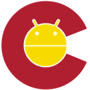

## Kotlin Lab Session

### Before the Meetup

So that we can get a quick and efficient start, please download intelliJ from https://www.jetbrains.com/idea/download/

Then in your IdeaProjects clone this repo: 

#### Contributions

We encourage attendees to push up a branch of your solutions to show off your Kotlin skills after the meetup!

### License and Usage

The original idea came from a JetBrains workshop at this repo https://github.com/jetbrains/kotlin-workshop

JetBrains and Kotlin are Registered Trademarks of their respective trademark holders.
